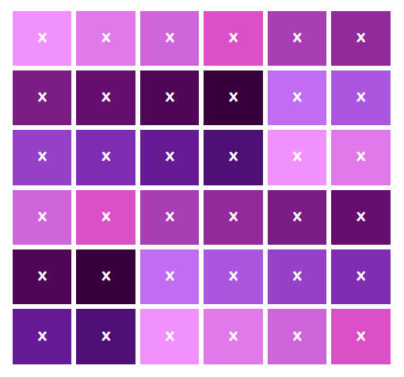

# Het randomizeren van arrays in JavaScript

## Een eenvoudig algoritme en het splitsen van een string

Voor een project waar ik mee bezig ben wil ik, zonder gebruik te maken van een framework als jQuery of Lodash, een array randomiseren en daar vervolgens overheen itereren. Nu zijn er verschillende manieren om dit randomiseren te bewerkstelligen, maar ik vond online al vrij snel een algoritme dat een fatsoenlijke performance had, en daarbij de naam droeg van een oude computerheld: dus dat maar gebruikt:

```javascript
// knuth array shuffle
// from https://bost.ocks.org/mike/shuffle/
function shuffle(array) {
  var currentIndex = array.length, temporaryValue, randomIndex;
 
  // While there remain elements to shuffle...
  while (0 !== currentIndex) {
    // Pick a remaining element...
    randomIndex = Math.floor(Math.random() * currentIndex);
    currentIndex -= 1;
 
    // And swap it with the current element.
    temporaryValue = array[currentIndex];
    array[currentIndex] = array[randomIndex];
    array[randomIndex] = temporaryValue;
  }
 
  return array;
}
```

Hoewel een string ook in Javascript feitelijk een array van karakters is, werkte de aanroep naar de bovenstaande functie met een String als actuele parameter niet in één keer. Dat verbaasde me, want

```javascript
> let foo="ABC"
> foo[2]
'C'
> 
```

Maar gelukkig heeft JavaScript een goeie methode om een string om een specifieke array te maken van een array: split(). Zo geeft `"A B C".split(' ')` de array `['A','B','C']` terug. Het probleem hiermee was evenwel dat de string in kwestie niet gescheiden zou worden door een specifiek karakter: alle letters stonden eenvoudig achter elkaar. Nu zou je verwachten dan `split()` dan zou werken, maar dat bleek niet het geval te zijn. Uiteindelijk bleek `split('')` (dus met een lege string als parameter) het werk te doen:

```javascript
> let foo = "BSDASCDASDFDAS".split('');
> foo
[
  'B', 'S', 'D', 'A',
  'S', 'C', 'D', 'A',
  'S', 'D', 'F', 'D',
  'A', 'S'
]
> shuffle(foo)
[
  'S', 'D', 'B', 'A',
  'D', 'D', 'F', 'D',
  'A', 'S', 'S', 'C',
  'A', 'S'
]
> 
```

## Splitsen van `HtmlElement`-nodes

Met getallen en strings werkte deze methode prima. Maar toen ik het wilde gebruiken om een array van html-elementen door elkaar te gooien, ging het mis. Omdat ik geen JavaScript-framework wilde gebruiken, moest terugvallen op de bekende ouderwetse methode van het selecteren van DOM-elementen. In dit specifieke geval had ik een tabel met zesendertig feitelijk identieke `td`’s: het enige verschil tussen deze elementen was hun positie in de tabel. Hierdoor kon de JavaScript-engine geen onderscheid maken tussen de gewone en de geshuffelde array:


```javascript
let foo = document.getElementsByTagName('td');
let bar = shuffle(foo);
console.log(foo==bar); //true
```

Tijd om iets anders te bedenken. Omdat ik een situatie had waarin ik gegarandeerd elk element uit de array exact één keer moest langslopen, kon ik niet eenvoudig een ‘gerandomizede’ pointer naar de array gebruiken. Een mogelijke oplossing zou zijn om een willekeurige pointer te maken, dat element uit de array te halen en een nieuwe array te maken uit de elementen voor en de elementen na deze pointer – dus dat de nieuwe array telkens één element korter is dan de oorspronkelijke. In node leek dit een hoopvolle route, maar de browser bleek de methode `slice()` niet te ondersteunen – die je nodig hebt om de oorspronkelijke array in stukjes te knippen.

Wat nu wanneer we het element dat door de gerandomizede pointer wordt aangewezen `null` maken en hierna over de array heen itereren en elk element dat niet `null` is aan een nieuwe array toevoegen? Dit leek in ieder geval wel te werken voor eenvoudige strings:

```javascript
let b = "BSDASCDASDFDAS";
let foo = b.split('');
 
foo[4] = null;
 
var bar=[];
var j=0;
 
for (var i=0; i<foo.length; i++) {
  if (foo[i]!=null) {
    bar[j]=foo[i];
    j++;
  }
}
 
console.log(foo); //[ 'B', 'S', 'D', 'A', null, 'C', 'D', 'A', 'S', 'D', 'F', 'D', 'A', 'S' ]
console.log(bar); //[ 'B', 'S', 'D', 'A', 'C', 'D', 'A', 'S', 'D', 'F', 'D', 'A', 'S' ]
```

Op basis hiervan maakte ik een functie `removeFromArray()` die een array als parameter krijgt een dezelfde array zonder null-values teruggeeft. Om dit goed te testen maakte ik een tabelletje met zes keer zes cellen die ik in eerste instantie oplopende kleuren gaf:

```javascript
const colors = ["#f291fb", "#e279eb", "#d064da", "#db50c7", "#a93db3", "#932a9c", "#7a1c83", "#650e6d", "#4f0656", "#37023c", "#c06df4", "#aa56e0", "#9542c9", "#7f2eb2", "#661a96", "#4e0e76"];
 
function init() {
  const els = document.getElementsByTagName("td");
  var e;
  var j=0;
 
  for (var i=0; i<els.length; i++) { 
      e = els[i]
      e.classList.value=""
      e.bgColor=colors[j]
      j>colors.length-1 ? j++ : j=0
  }
}
```



Nu is de uitdaging om niet *lineair* over de els-array te itereren, maar om dat te doen met een willekeurige pointer bij elke iteratie, en dat element via de hierboven beschreven methode uit de array te halen.

```javascript
function init() {
  const els = document.getElementsByTagName("td")
  var e
  var j=0
  var idx
 
  while (els.length) {
    idx = Math.floor(Math.random() * els.length)
 
    e = els[idx]
    e.classList.value=""
    e.bgColor=colors[j]
 
    els[idx] = null
    els = removeFromArray(els)
 
    j>colors.length-1 ? j++ : j=0
  }
}

```

En dat levert inderdaad het gewenste resultaat op:


## Laatste eindjes

Wat nog wel een beetje gedoe was, was dat `document.getElementById()` geen array, maar een `htmlCollection` oplevert (terwijl er maar één elemenent dat specifieke id zou moeten hebben). Hierdoor werd dit pas na de eerste call naar `removeFromArray()` een echte array. Dus ik moest die `htmlCollection` even expliciet omzetten naar een `Array`:

```javascript
var els = [].slice.call(tdElements);
```

Wel een beetje raar dat ik daar pas achter kwam toen ik verder met het project ging – met die kleurtjes ging het goed. Soit.

