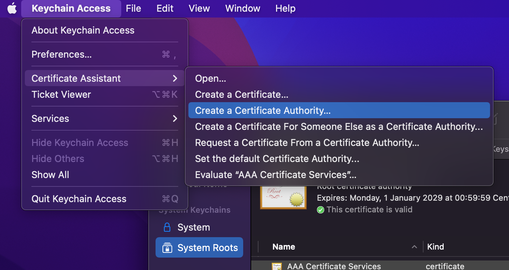
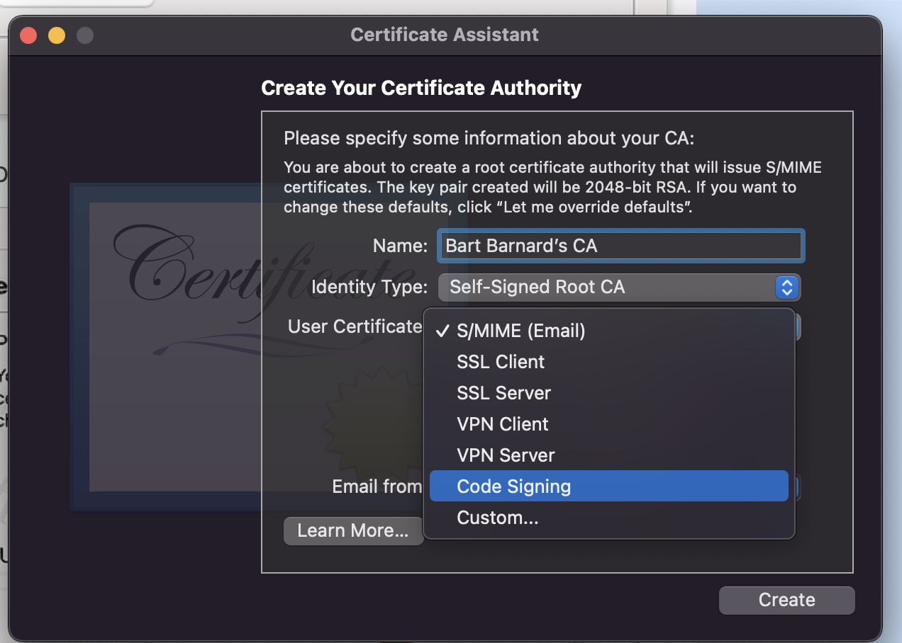
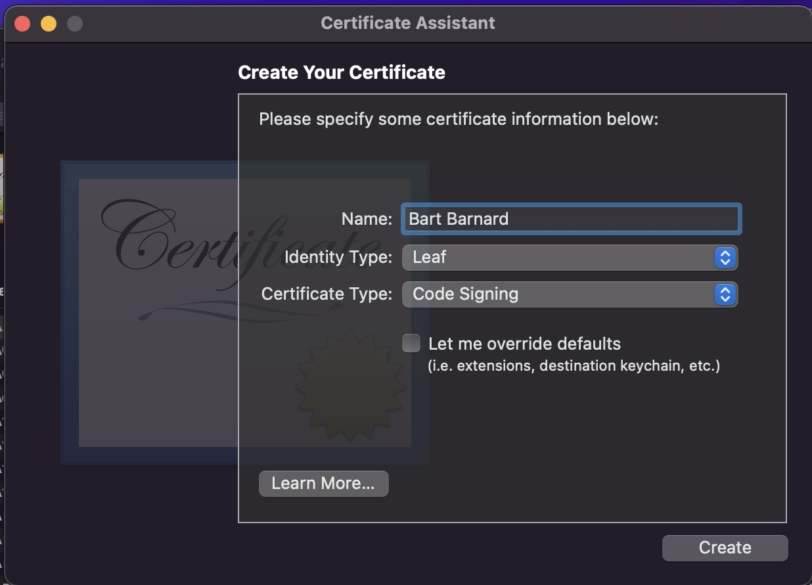
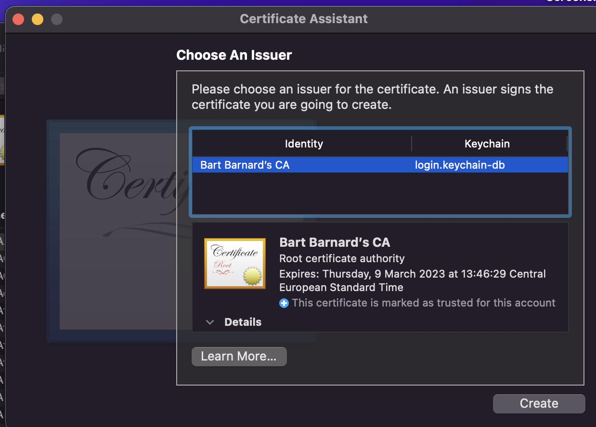
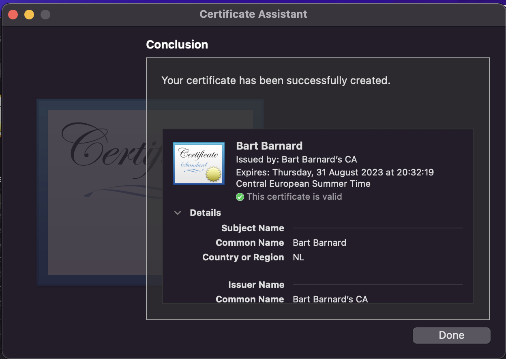
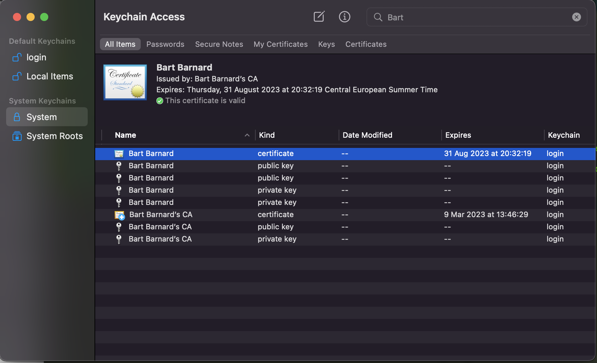
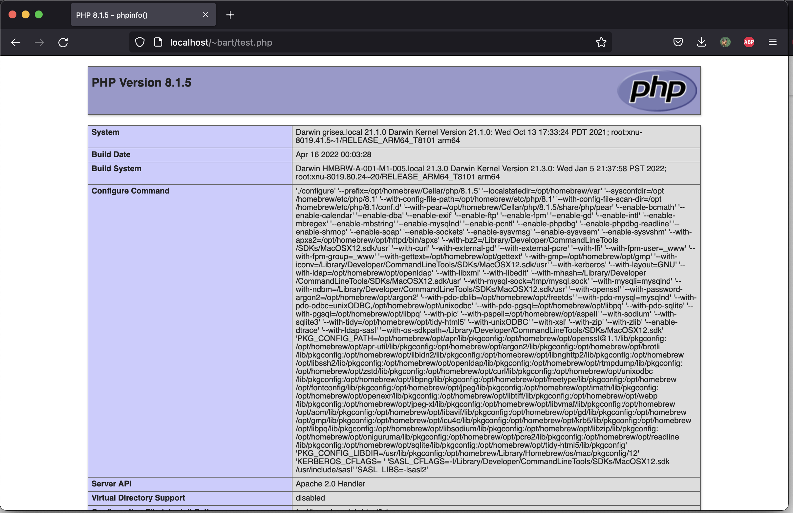

# PHP onder apache op OS-X Montery

## Inleiding

Sinds OS-X versie 11 is PHP onder Apache deprecated en sinds versie 12 is het zelfs helemaal uit OS-X verdwenen. Je kunt er altijd op vertrouwen dat Apple de normale dingen nodeloos complex maakt. Al eerder [was me opgevallen](https://twitter.com/BartBarnard/status/1380473719454334978) dat git na een update van het OS niet meer draait omdat `xcrun` niet meer gevonden kan worden, en eveneens zijn na een update de configuraties van directories onder `private` weggehaald (en op je Desktop in een directory `Relocated Items` geplaatst).

Maar goed, PHP heeft natuurlijk een ingebouwde ontwikkelserver, dus installeren met `homebrew` en ontwikkelen die hap. Alleen het wordt dan lastig wanneer je de aldus ontwikkelde code op je productieserver wilt zetten en de hele boel in elkaar sodomietert. Een te groot verschil tussen ontwikkeling en productie is nooit handig, dus toch maar even een avondje gespendeerd om de boel weer in sync te krijgen – en dit verslagje te schrijven voor een eventuele volgende keer.

## De foutmelding

Normaliter kun je Apache eenvoudig configureren zodat php hierdoor wordt herkend. Eenvoudig de betreffende regel in de `httpd.conf` uit het commentaar halen. Alleen als je dat doet, krijg je de volgende foutmelding:

```shell
bart@grisea ~ % apachectl configtest
[Wed Aug 31 20:36:02.173409 2022] [so:error] [pid 94405] AH06665: No code signing authority for module at /opt/homebrew/opt/php/lib/httpd/modules/libphp.so specified in LoadModule directive.
httpd: Syntax error on line 170 of /private/etc/apache2/httpd.conf: Code signing absent - not loading module at: /opt/homebrew/opt/php/lib/httpd/modules/libphp.so
bart@grisea ~ % 
```

Dat correspondeert wel met wat er iets verderop in `httpd.conf` staat:

```shell
#PHP was deprecated in macOS 11 and removed from macOS 12
```

Toen ik die foutmelding googelde (of *duckduckgo'de* in mijn geval) kwam ik [op deze site die is al eens eerder had bezocht](https://www.simplified.guide/macos/apache-php-homebrew-codesign). En toen herinnerde ik me dat ik deze exercitie bij mijn vorige computer ook al had gedaan; ik kon me alleen niet herinneren of het toen gelukt was. Soit, toch maar proberen.

## Stap 1: Maken van het certificaat

Feitelijk is het niet heel moeilijk. OS-X zeurt er over dat de php-binary niet is ondertekend. Dus je moet het ding ondertekenen. Maar ondertekenen kan alleen maar gebeuren door een authoriteit – een beetje vergelijkbaar met dat je een paspoort hebt dat door de staat is uitgegeven: het paspoort is de ondertekening en de staat is de authoriteit. De eerste stap is dus het aanmaken van een authoriteit.

Vanuit `Keychain Access` kun je de `Certificate Assistant` selecteren en van daaruit de optie `Create Certificate Authority`. Hierin kun je aangeven dat de authoriteit bedoeld is om code te ondertekenen:





De volgende stap is het maken van een certificaat. Dit doe je via dezelfde `Certificate Assistant`. Ook hier moet je weer aangeven dat het certificaat bedoeld is om code te ondertekenen. Verder moet het type een `Leaf` zijn 🤔. Wanneer je hier op `Create` klikt, komt de vraag wie de Issuer is. Kies hier de authoriteit die je hierboven hebt gemaak.






Als alles goed is gegaan, krijg je nu de melding dat het certificaat gemaakt is. Je krijgt het ook te zien in de `Keychain Access` applicatie zelf.





## Stap 2: Aan de praat krijgen van de software

Nu het certificaat gemaakt is, kunnen we dat gebruiken om de binary van php te ondertekenen. Hiervoor moet je wel weten waar dat ding staat, maar als het met `homebrew` geïnstalleerd is, staat het vast ergens in de `Cellar`. 

Voor het ondertekenen maken we gebruik van de [`codesign` utility](https://www.digicert.com/kb/code-signing/mac-os-codesign-tool.htm) (lees de man-page als je een idee wilt krijgen van wat dat ding doet). De algemene syntax is `codesign --sign CERTIFICATE --keychain LOCATION_TO_KEYCHAIN BINARY`. In mijn geval werd het dus:

```shell
codesign --sign "Bart Barnard" --force --keychain ~/Library/Keychains/login.keychain-db /opt/homebrew/opt/php/lib/httpd/modules/libphp.so
```

(In de man-page staat over dat `force` het volgende: "When signing, causes codesign to replace any existing signature on the path(s) given. Without this option, existing signatures will not be replaced, and the signing operation fails.")

Als we nu de betreffende regel in `httpd.conf` uit het commentaar halen en een configtest doen, dan lijkt alles goed te gaan.

```
bart@grisea ~ % apachectl configtest
[Wed Aug 31 20:41:05.328991 2022] [so:notice] [pid 94477] AH06662: Allowing module loading process to continue for module at /opt/homebrew/opt/php/lib/httpd/modules/libphp.so because module signature matches authority "Bart Barnard" specified in LoadModule directive
Syntax OK
bart@grisea ~ % 
```

Dus Apache herstarten, een `phpinfo()`-testbestandje maken in `~/Sites/` en checken die handel:



Het werkt! Hiermee hebben we de productie- en ontwikkelomgeving weer wat meer gelijk getrokken, wat fijn is voor een ander project waar ik vanmiddag mee bezig was en wat stagneerde omdat de ontwikkelserver van PHP toch iets anders deed dan Apache zelf.

## Conclusie

Ik begrijp het idee van Apple dat software ondertekend moet worden; als je alles maar toelaat loop je groter risico om ondeugdelijke of gevaarlijke software. Maar om PHP, geïnstalleerd door `homebrew` op deze manier te diskwalificeren lijkt me volstrekt onterecht. Het is nog steeds één van de meest gebruikte backend-talen en niet iedereen heeft de luxe van een greenfield-situatie waarin je een andere server kunt gebruiken dan Apache.

Gelukkig is het ondertekenen niet zo heel lastig, zoals we hierboven hopelijk hebben laten zien.


