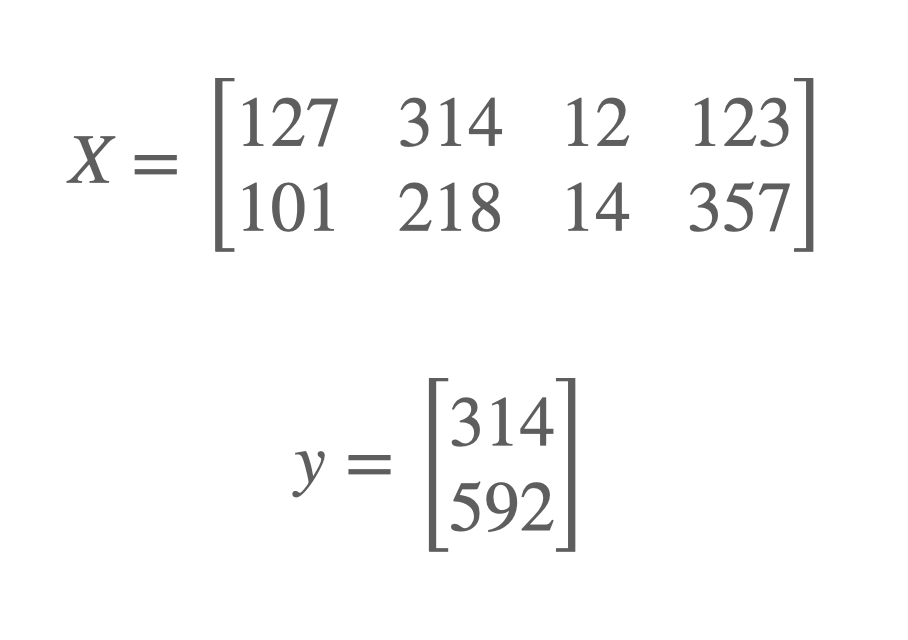
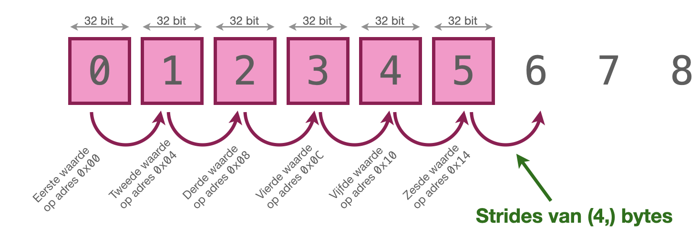
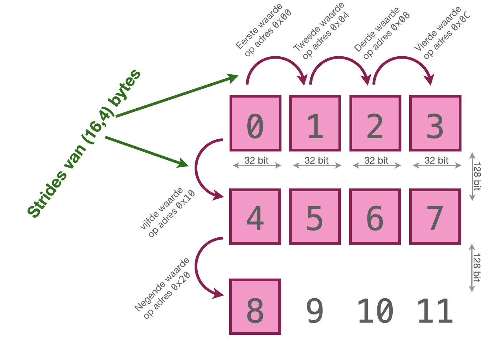

---
date: 20 september 2022
---

## Introductie

Om de *grootte*, de *dimensionaliteit* van een matrix of vector in numpy weer te geven, maken we gebruik van de eigenschap `shape` van deze datatypen. Zo is de `shape` van de matrix $X$ hieronder `(3,2)` en die van de vector $y$ `(2,1)`. 



Voor mensen die net met numpy beginnen, is het vaak verwarrend dat wanneer we een vector aanmaken, deze een `shape` krijgt met maar één getal. Op zich hoeft dat geen probleem te zijn, omdat we ook met zo'n op zich vreemde `shape` gewoon wiskundige operaties kunnen uitvoeren:

```python
>>> foo = np.array(np.arange(5))
>>> foo
array([0, 1, 2, 3, 4])
>>> foo.shape
(5,)
>>> foo+1
array([1, 2, 3, 4, 5])
>>> 
```

Er kan evenwel een probleem optreden wanneer we vectoren bij elkaar willen optreden, of matrixen met vectoren willen vermenigvuldigen (iets wat we nogal eens willen doen wanneer we bijvoorbeeld games ontwikkelen of met *machine learning* aan de gang gaan). Zoals bekend is het resultaat van de vermenigvuldiging van een $m \cdot n$ matrix met een $n \cdot 1$ vector een $m \cdot 1$ vector. Maar dan moeten die beide `n`-waarden wel met elkaar corresponderen, anders krijgen we onverwachte resultaten:

```python
>>> m1 = np.array([np.arange(5),np.arange(5)])
>>> m1.shape
(2, 5)
>>> np.dot(m1,foo).shape
(2,)
>>> np.dot(m1,foo.reshape(5,1)).shape
(2, 1)
>>> 
```

We zien hier dat het rare formaat van `(2,)` terugkomt wanneer we eigenlijk een `(2,1)`-vector verwachten. Zeker wanneer we een vergelijkbaar resultaat op zijn beurt weer willen inzetten in verdere berekeningen, kan het daardoor wel eens stuk gaan, zelfs wanneer we de vectoren transponeren...

```python
>>> np.dot(m1,foo).dot(foo)
Traceback (most recent call last):
  File "<stdin>", line 1, in <module>
ValueError: shapes (2,) and (5,) not aligned: 2 (dim 0) != 5 (dim 0)
>>> # transponeren helpt niet
>>> np.dot(m1,foo).dot(foo.T)
Traceback (most recent call last):
  File "<stdin>", line 1, in <module>
ValueError: shapes (2,) and (5,) not aligned: 2 (dim 0) != 5 (dim 0)
>>> # let maar op wat hier gebeurt
>>> foo.shape
(5,)
>>> foo.T.shape
(5,)
>>> 
```

Om goed te begrijpen wat hier gebeurt, is het noodzakelijk even in te gaan op de manier waarop numpy data opslaat.

## Strides

Hoewel numpy [een concept van matrixen heeft](https://numpy.org/doc/stable/reference/generated/numpy.matrix.html), worden die niet meer ondersteund en zullen ze in een volgende versie verwijderd worden. Numpy heeft eigenlijk alleen maar vectoren. 

Eén van de redenen dat numpy zo snel is, is dat de data altijd in één aaneengesloten blok gebeugen wordt opgeslagen (een zogenaamd *contiguous memory block*). Dat zorgt ervoor dat het zoeken van een waarde in een lijst in constante tijd kan worden uitgevoerd – er is immers bekend hoe groot de datatypen zijn die zijn opgeslagen, dus een eenvoudige vermenigvuldiging levert het adres van elk element in een lijst op.

Dat betekent dat wanneer we in numpy aan array maken, er eenvoudig een set van getallen achter elkaar in het geheugen wordt opgeslagen (de *data buffer*). Wanneer we deze set van getallen als een *matrix* willen zien, moeten we dat expliciet met `reshape` aangeven. Op deze manier kunnen we de data op elke manier representeren die we nodig hebben

```python
>>> m1 = np.array(np.arange(12), dtype=np.int32)
>>> m1
array([ 0,  1,  2,  3,  4,  5,  6,  7,  8,  9, 10, 11], dtype=int32)
>>> m1.reshape(3,4) 
array([[ 0,  1,  2,  3],
       [ 4,  5,  6,  7],
       [ 8,  9, 10, 11]], dtype=int32)
>>> m1.reshape(4,3)
array([[ 0,  1,  2],
       [ 3,  4,  5],
       [ 6,  7,  8],
       [ 9, 10, 11]], dtype=int32)
>>> 
```

Al deze acties veranderen de oorsponkelijke data niet, maar alleen de representatie ervan. Zelfs wanneer we bij het aanmaken van een matrix een bepaalde vorm meegeven, is de data nog steeds opgeslagen in één *ontiguous memory block*. 

Wanneer we de data op een bepaalde manier representeren, bijvoorbeeld omdat we het als een matrix willen gebruiken, veranderen we eigenlijk alleen maar de *view* op de data buffer. Feitelijk is deze *view* onderdeel van de *metadata* die door numpy wordt bijgehouden en die ook nog andere dingen bevat (zoals de byte-order of het datatype). Met het gebruik van `reshape` geven we numpy informatie over de zogenaamde `stride` van de data: de *grootte van de stappen* waarmee door de data heengelopen moet worden. 

Bestudeer de volgende code:

```python
>>> 
foo = np.array(np.arange(12), dtype=np.int32)
>>> foo.strides
(4,)
>>> 
```

We zien dat `foo` een `stride` heeft van `(4,)`. Dat houdt in dat om van de eerste naar de tweede waarde in de lijst van `foo` te gaan, de interne pointer als het ware vier bytes moet opschuiven; dat klopt ook, want we hebben expliciet aangegeven dat er 32 bits integers in de array zijn opgeslagen, en vier bytes is 32 bits. 

We komen zo terug op de vraag waarop we hier weer die `,)` hebben; bekijk daarvoor het volgende voorbeeld:

```python
>>> foo.reshape(3,4)
array([[ 0,  1,  2,  3],
       [ 4,  5,  6,  7],
       [ 8,  9, 10, 11]], dtype=int32)
>>> foo.reshape(3,4).strides
(16, 4)
>>> 
```

Nu zien we `foo` als een 4 &times; 3 matrix. Als we hier de `stides` van opvragen, krijgen we wel twee waarden: het *eerste* getal in de tupel geeft aan hoeveel bytes de naastgelegen elementen in dezelfde *kolom* van een element verwijderd zijn: om één element omhoog of omlaag te gaan, moeten we de interne pointer als het ware 16 bytes verhogen of verlagen. Om naar het naastliggende element in dezelfde *regel* te gaan, moeten we de interne pointer vier bytes verhogen of verlagen.






Dit verklaart ook waarom we initieel een `strides` hadden van `(4,)`: in de databuffer zelf hebben we geen andere representatie dan een lijst van getallen', dus we kunnen maar één waarde hebben om aan te geven hoe we naar een naastliggend element moeten gaan. Een tweede waarde in dat tupel zou geen betekenis hebben.


## Meerdere dimensies

Er is geen enkele reden om deze techniek te laten stoppen bij slechts twee dimensies. Met behulp van die `reshape` en de `strides` kunnen allerlei verschillende views op dezelfde data verkrijgen:

```python
>>> m1 = np.array(np.arange(12), dtype=np.int32)
>>> m1.reshape(3,2,2)
array([[[ 0,  1],
        [ 2,  3]],

       [[ 4,  5],
        [ 6,  7]],

       [[ 8,  9],
        [10, 11]]], dtype=int32)
>>> m1.reshape(3,2,2).strides
(16, 8, 4)
>>> 
```

Wat hier opvalt is dat het aantal elementen in de `strides` aangeeft hoeveel stappen je moet zetten om bij één individueel element uit de data buffer uit te komen. In het geval van de data buffer zelf is één waarde genoeg, in een twee-dimensionale matrix moet je twee waarden opgeven (en de `strides`-tupel heeft ook twee waarden) en in de drie-dimensionale matrix hierboven moet je drie waarden opgeven voordat je bij een individueel getal uitkomt:

```python
>>> m1.reshape(3,2,2)[1]
array([[4, 5],
       [6, 7]], dtype=int32)
>>> m1.reshape(3,2,2)[0]
array([[0, 1],
       [2, 3]], dtype=int32)
>>> m1.reshape(3,2,2)[0][1]
array([2, 3], dtype=int32)
>>> m1.reshape(3,2,2)[0][1][0]
2
>>> >>> m1.reshape(3,2,2)[0,1,0] #<-- let op deze syntax
2
>>> 
```

Hiermee is ook het verschil tussen `(12,)` en `(12,1)` expliciet geworden. Hoewel het op het eerst gezicht min of meer hetzelfde lijkt te doen, introduceert de tweede notatie een extra dimensie. Hoewel er maar één regel in deze dimensie zit, gebeurt er wel degelijk iets anders:

```python
>>> m1.shape
(12,)
>>> m1[1]
1
>>> m1.reshape(12,1)[1]
array([1], dtype=int32)
>>> 
```

In het eerste geval komt er direct een getal terug (`stides` heeft één waarde), terwijl er in het tweede geval een array met één element terugkomt (`strides` heeft dan ook twee waarden).

## Verder lezen

De interne werking van numpy is interessant, maar ook complex. Ook in het geval van arrays is er nog meer te vertellen dan ik hier heb kunnen doen. Op details is het nog iets complexer, wanneer we bijvoorbeeld denken over of het eerste getal de regel of juist de kolom weergeeft. Op [numpy.org wordt dit redelijk uitgebreid uit de doeken gedaan](https://numpy.org/devdocs/dev/internals.html). Desalniettemin hoop ik hiermee wat duidelijkheid geschapen te hebben in een toch wat onderbelicht maar belangrijk detail van werken met arrays in numpy.


