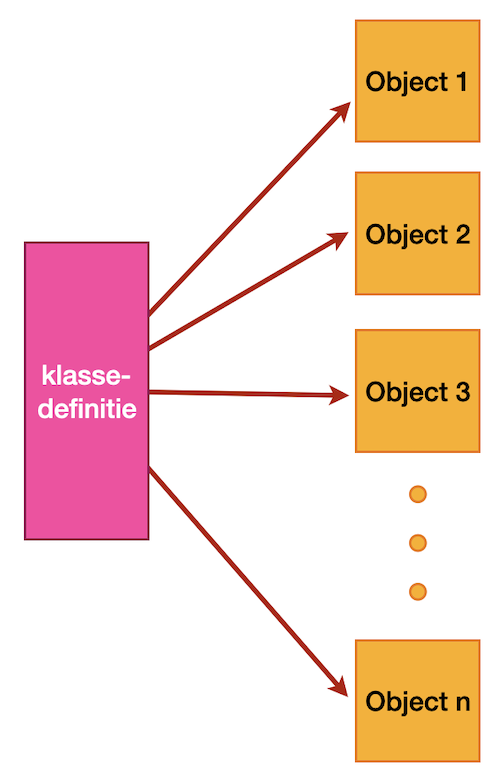

# Python `self`

Wanneer je in Python met klassen gaat werken, zie je dat elke methode in die klasse als eerste parameter `self` heeft staan. Zelfs als een methode verder geen parameters heeft, is er nog altijd die `self`. Waarom staat die parameter daar, wat betekent het en hoe komt het dat we een dergelijke methode kunnen aanroepen zonder die parameter expliciet mee te geven?

## Klassen en objecten

Wanneer we object georiënteerd programmeren, schrijven en gebruiken we klassen en hun onderlingen verhoudingen. Klassen leveren een algemene abstracte beschrijving van een set van data en functionaliteiten. Je kunt je voorstellen dat je een algemene beschrijving hebt van een tafel (het standaardvoorbeeld). In die beschrijving stel je bijvoorbeeld dat een tafel een aantal poten, een kleur en bepaalde afmetingen heeft.

Op basis van deze algemene beschrijving kun je dan verschillende concrete tafels als tafel identificeren: deze bruine tafel heeft vier poten en meet honderd bij honderdtwintig centimeter. Deze andere concrete tafel is wit, heeft zes poten en is tweeënhalve meter lang.

Bij het programmeren gebeurt feitelijk hetzelfde. Van algemene abstracte omschrijvingen (de klassen) maken we concrete instanties: de objecten. Die objecten voldoen allemaal aan de algemene omschrijving, maar kunnen voor de diverse onderdelen van die omschrijving verschillende waarden hebben.



## Namen en dingen

Wanneer we van een klasse een object aanmaken, kun je zeggen dat we een ding aanmaken (net als we een concrete tafel maken). Om over dat ding te kunnen spreken, moeten we dat ding een naam geven. In de regel werkt dat eenvoudig door een variabele aan te maken en die te koppelen aan het ding in kwestie. Stel je voor dat een Python-klasse `Foo` hebben, dan maken we daar op de volgende wijze een object van en geven we dat de naam `f`:

```python
f = Foo()
```

Wanneer we nu willen dat f de functionaliteit bar gaat uitvoeren, gebruiken we de syntax `f.bar()`. Je kunt je dit voorstellen als dat je eerst het ding bij de naam noemt (`f`) en vervolgens zegt dat het iets moet doen (`bar`).

## Proprioceptie

Objecten moeten ook van zichzelf weten wie of wat ze zijn. Ze hoeven niet te weten hoe ze genoemd worden, maar wel welke eigenschappen en functionaliteiten ze allemaal in zichzelf herbergen. Om dit te bewerkstelligen hebben de meeste OO-talen een specifieke constructie die de objecten in stelt naar zichzelf te verwijzen. Zo hebben Java, C# of TypeScript het sleutelwoord `this`, dat verwijst naar de huidige concrete instantie van de klasse, maakt Swift gebruik van `self` voor hetzelfde doel en gebruikt Ruby een `@` om duidelijk te maken dat het om de instantie zelf gaat.

In al deze voorbeelden is sprake van een sleutelwoord: `this` en `self` zijn *taalconstructies* die automatisch en impliciet de referentie naar de huidige instantie bevatten.

In Python is ervoor gekozen om deze referentie expliciet te maken, en wel door de eerste parameter van elke methode in een klasse naar de instantie zelf te laten verwijzen. Guido van Rossum himself [schrijft uitgebreid over deze keuze in deze blog](http://neopythonic.blogspot.com/2008/10/why-explicit-self-has-to-stay.html), maar in het kort komt het er op neer dat er (zeker in het geval van Python) veel voordelen zijn voor deze expliciete toewijzing.

We kunnen dit gebruik van die eerste parameter als volgt demonstreren. In plaats van de methode aan te roepen op de variabele, kunnen we het ook aanroepen op de klasse, waarbij we de variabele expliciet aan de call meegeven:

```python
f = Foo()
f.demo(42)
Foo.demo(f, 42)
```

Het is dus belangrijk je te realiseren dat self altijd naar het huidige concrete object verwijst.

```python
class Foo:
  def demo(self, waarde):
    print (f'In klasse Foo, methode demo met waarde {waarde}')

f = Foo()
f.demo(42)
Foo.demo(f, 42)
```

Het resultaat van de bovenstaande code is twee keer hetzelfde. In beide gevallen wordt de methode demo aangeroepen met `f` als eerste parameter.

## Gewoon nog een parameter

Omdat de eerste parameter die aan instantie-methoden wordt meegegeven altijd de verwijzing naar die instantie is, is `self` geen sleutelwoord. Je kunt in principe elke andere parameter-naam daarvoor gebruiken.

```python
class Foo:
  def demo(*8niet_self, waarde):
    niet_self.param = waarde

f = Foo()
f.demo(42)
print (f.param)
#Output: 42
```

Het gebruik van self voor deze parameter is echter een Python-conventie en je zult raar worden aangekeken wanneer je hier iets anders voor gebruikt. Hoewel er hier en daar wel stemmen opgaan om `my` te gebruiken – en ja, dat leest eigenlijk wel wat lekkerder…

```python
class Foo:
  def demo(my, waarde1, waarde2, waarde3):
    my.param1 = waarde1
    my.param2 = waarde2
    my.param3 = waarde3
```

## Klein verschil met `this`

Voor de fijnproevers onder u: er is een klein maar belangrijk verschil met `this` in talen als Java en C# en die eerste parameter in Python-klassen: wanneer je een ouder-kindrelatie hebt met klassen die van andere klassen overerven, verwijst `this` in de *ouder* in Java naar die ouder, terwijl `self` in de ouder in Python verwijst naar het *kind*.

